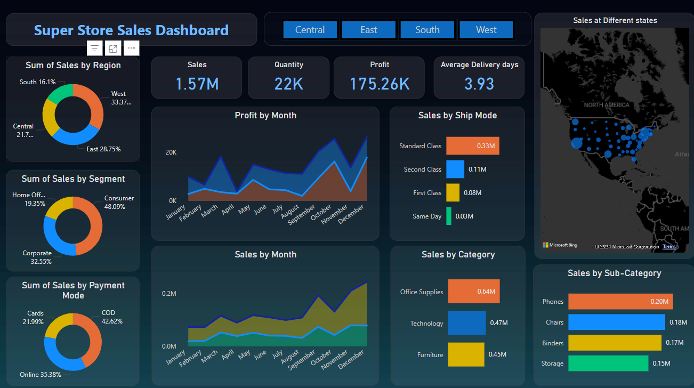
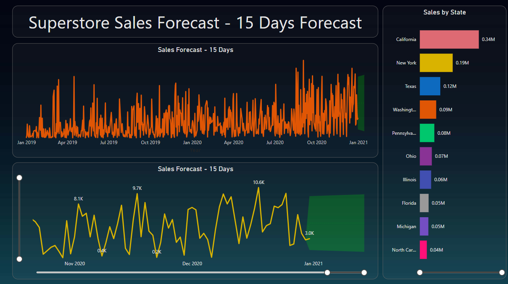

# Superstore_sales_PowerBI_Project

---

## Project Overview

The **Super Store Sales Dashboard** is an interactive Power BI dashboard designed to provide comprehensive insights into sales performance. It consolidates various metrics, such as sales by region, segment, and payment mode, profit by month, and sales distribution across ship modes, categories, and sub-categories. The dashboard empowers sales teams by delivering actionable insights that enhance business performance and operational efficiency.

# Super Store Sales Dashboard

---

## Features

- **Total Sales Metrics**: Displays total sales, quantity, profit, and average delivery days.
- **Sales by Region**: A donut chart showing the percentage distribution of sales across four regions: South, West, Central, and East.
- **Sales by Segment**: A segmentation of sales by Consumer, Corporate, and Home Office customers.
- **Sales by Payment Mode**: Shows the breakdown of sales by payment mode, including Cards, Cash on Delivery (COD), and Online.
- **Profit by Month**: A line chart tracking monthly profit throughout the year.
- **Sales by Ship Mode**: Bar chart illustrating sales by shipping method, including Standard Class, Second Class, First Class, and Same Day.
- **Sales by Category and Sub-Category**: Highlights sales within main categories (e.g., Office Supplies, Technology, Furniture) and further breakdown into sub-categories (e.g., Phones, Chairs, Binders, Storage).
- **Sales by Month**: Monthly breakdown of sales volume.
- **Geographical Distribution**: A map showing sales concentration by state within the United States.

## Dashboard Controls

The dashboard includes filters for selecting different regions (Central, East, South, West), allowing users to drill down into regional data and observe changes in sales metrics.

## Usage

1. **Explore Sales Metrics**: Use the visualizations to understand overall sales, customer segmentation, and payment preferences.
2. **Track Profit Trends**: Analyze profit changes across months to identify peak periods.
3. **Shipping Insights**: Examine preferred shipping methods to improve logistics and customer satisfaction.
4. **Category Performance**: View high-performing categories and sub-categories to make inventory or marketing decisions.
5. **Geographical Analysis**: Understand sales patterns across states to optimize distribution.

## Technologies

- **Power BI**: For data visualization and interactive dashboard creation.
- **Excel**: For data cleaning.

## How to Use the Dashboard

1. Open the Power BI file in Power BI Desktop or view it in Power BI Service.
2. Use the region filter to view sales data specific to a region.
3. Interact with charts and graphs for detailed breakdowns by category, segment, payment mode, and shipping method.

---

## Sales Forecast Dashboard

The **Sales Forecast Dashboard** presents a 15-day sales forecast and trends for key states. It uses historical data to predict future sales, providing critical insights for planning and inventory management.

- **Sales Forecast (15 Days)**: Time series charts illustrate historical sales data and forecasted sales trends, highlighting expected sales for the next 15 days.
- **Sales by State**: Bar charts display sales in top states, allowing users to understand state-wise sales distribution.

---

## Dataset

The dataset used for this dashboard can be accessed here:

[Super Store Sales Dataset]([SuperStore Sales DataSet.xlsx](https://github.com/RutvijAhlaad/Superstore_sales_PowerBI_Project/blob/main/SuperStore%20Sales%20DataSet.xlsx))

---
